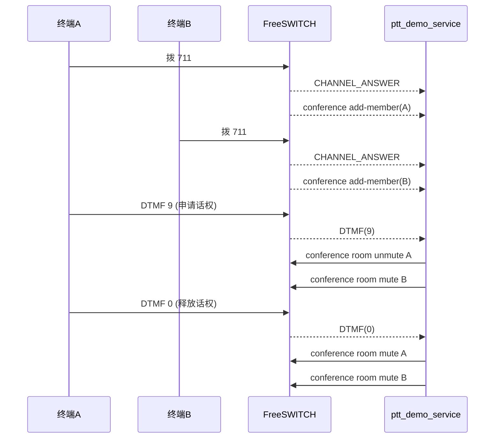

# PTT ESL 控制流说明

## 1. 目的

说明 PTT Demo 中 ESL（Event Socket Library）在“事件采集 + 控制执行”两条链路上的角色与调用顺序，便于联调和排障。

## 2. 连接模型

`ptt_demo_service.py` 建立两条 ESL TCP 连接到 `ESL_HOST:ESL_PORT`：

1. `esl_events`：订阅事件
2. `esl_api`：发送 API 命令

两条连接均执行：

```text
auth <password>
event plain CHANNEL_ANSWER CHANNEL_HANGUP_COMPLETE DTMF CUSTOM
```

## 3. 事件流

### 3.1 `CHANNEL_ANSWER`

用途：

1. 识别 `7xy` 呼叫。
2. 从导出变量读取 `ptt_room`、`ptt_site`、`ptt_channel`、`ptt_record_file`。
3. 建立活动呼叫状态。

关键字段：

- `Unique-ID`
- `Caller-Destination-Number`
- `variable_ptt_room`
- `variable_ptt_record_file`

### 3.2 `CHANNEL_HANGUP_COMPLETE`

用途：

1. 活动通话转历史日志。
2. 计算时长、状态、录音文件大小。
3. 若该 call 持有话权，自动释放并下发静音策略。

### 3.3 `DTMF`

用途：

1. `9` -> 申请话权
2. `0` -> 释放话权
3. `1/2/3` -> 触发机器人播报

说明：

- `9/0` 优先按半双工控制处理。
- `1/2/3` 保持原有机器人能力。

### 3.4 `CUSTOM`（`conference::maintenance`）

用途：

1. `add-member`：更新 room 成员映射。
2. `del-member` / `remove-member`：移除映射。
3. 成员变更后立即同步房间静音策略。

常见字段：

- `Event-Subclass: conference::maintenance`
- `Action`
- `Conference-Name`
- `Member-ID`
- `Unique-ID`

## 4. 控制命令流

### 4.1 房间播报

机器人播报命令：

```text
conference <room> play <file_path>
```

### 4.2 半双工控制

成员权限控制命令：

```text
conference <room> mute <member_id>
conference <room> unmute <member_id>
```

策略：

1. holder -> `unmute`
2. 非 holder -> `mute`
3. 无 holder -> 全员 `mute`

## 5. 状态机与定时器

### 5.1 申请话权

输入：`call_id`

输出：

- `granted`
- `renewed`
- `busy`
- `call_not_found`
- `room_not_found`

### 5.2 释放话权

输入：`call_id`

输出：

- `released`
- `idle`
- `not_holder`
- `not_found`

### 5.3 过期释放

watchdog 每秒扫描 `expires_at_ts`，超时后释放并同步房间策略。

## 6. 对外接口

### 6.1 状态查询

1. `GET /api/ptt/state`
2. `GET /api/ptt/state/{site}/{channel}`

### 6.2 话权控制

1. `POST /api/ptt/floor/request`
2. `POST /api/ptt/floor/release`

请求体：

```json
{
  "call_id": "9de258e8-baf5-4cf9-9119-cd4f8f0e9123"
}
```

## 7. 关键排障点

1. `8021` 端口不可达：先恢复 ESL 连接，再看业务逻辑。
2. 收不到 `conference::maintenance`：检查 `CUSTOM` 事件订阅是否成功。
3. `mute/unmute` 无效：确认 `Member-ID` 与 `Conference-Name` 是否匹配。
4. API 返回 `call_not_found`：说明 call 已挂机或未进入活动状态。
5. 频繁 `busy`：可能 timeout 偏长，可调 `PTT_FLOOR_TIMEOUT_SECONDS`。

## 8. 时序图

