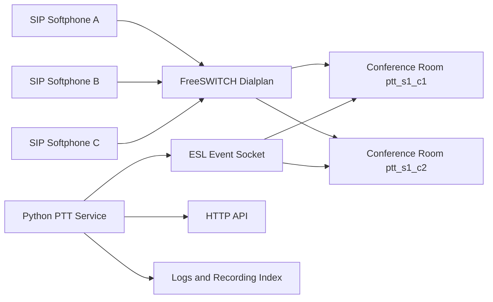

# FreeSWITCH 对讲功能实现分析

## 1. 目的

本文整理当前仓库中 FreeSWITCH 对讲功能的实现方式，说明以下问题：

- FreeSWITCH 中“对讲”常见的两种实现模式分别是什么。
- 当前仓库的 PTT Demo 实际采用了哪一种。
- 现有实现的数据流、信令流和媒体流是如何串起来的。
- 如果后续要演进为严格半双工 PTT，需要补哪些控制能力。

本文基于当前仓库中的以下实现与文档：

- `conf/vanilla/dialplan/default.xml`
- `conf/vanilla/dialplan/default/20_ptt_training_demo.xml`
- `conf/vanilla/autoload_configs/modules.conf.xml`
- `scripts/python/ptt_demo/ptt_demo_service.py`
- `docs/ptt-training-demo.md`
- `docs/ptt-softphone-quickstart.md`

---

## 2. FreeSWITCH 中“对讲”的两种常见实现方式

### 2.1 点对点自动应答 Intercom

这是 FreeSWITCH 里最传统的“对讲”做法，特点是：

- 本质仍然是一次普通呼叫。
- 被叫终端支持自动应答。
- 呼叫建立后双方直接通话。

当前仓库在 `conf/vanilla/dialplan/default.xml` 中已有典型示例：

```xml
<extension name="extension-intercom">
  <condition field="destination_number" expression="^8(10[01][0-9])$">
    <action application="set" data="dialed_extension=$1"/>
    <action application="export" data="sip_auto_answer=true"/>
    <action application="bridge" data="user/${dialed_extension}@${domain_name}"/>
  </condition>
</extension>
```

这类模式适合：

- 前台呼叫总机
- 护士站呼叫病房
- 办公内线一键对讲

它的核心不是“频道”，而是“目标分机自动接听”。

### 2.2 基于 Conference 的群组式对讲 / PTT

这类模式不再把“对讲”看成两方之间的桥接，而是：

- 把一个组或一个频道映射成一个 conference 房间。
- 终端拨入后加入该房间。
- 同房间成员可互通，不同房间成员彼此隔离。

这正是当前仓库 PTT Demo 的实现方式。

它更适合：

- 多场地、多信道调度
- 训练对讲系统
- 组呼、编组隔离
- 后续扩展录音、日志、机器人播报、外部控制接口

---

## 3. 当前仓库采用的是哪一种

当前仓库的 PTT Demo 采用的是“基于 `mod_conference` 的群组式对讲”。

判断依据如下：

1. 拨号计划 `20_ptt_training_demo.xml` 将 `7xy` 映射为房间名 `ptt_s{site}_c{channel}@{domain}`。
2. 用户不是 `bridge` 到某个具体分机，而是执行 `conference ${ptt_room}`。
3. `mod_event_socket` 被同时用于外部事件采集与 API 控制。
4. Python 服务通过 ESL 执行 `conference room play file`，向指定房间注入提示音。

因此，这套实现的本质是：

- SIP 注册 + 拨号计划路由
- Conference 作为媒体混音和成员容器
- ESL 作为状态采集和外部控制通道
- HTTP API 作为对外的查询与控制接口

---

## 4. 当前 PTT Demo 的实现链路

### 4.1 模块依赖

当前实现至少依赖以下 FreeSWITCH 模块：

- `mod_conference`
- `mod_event_socket`

其中：

- `mod_conference` 负责房间、混音、成员管理。
- `mod_event_socket` 负责向外暴露 ESL 事件和 API 命令通道。

### 4.2 拨号规则

在 `conf/vanilla/dialplan/default/20_ptt_training_demo.xml` 中，拨号规则为：

- `7xy`
- `x` 表示场地编号（1-4）
- `y` 表示信道编号（1-4）

示例：

- `711` -> 场地 1，信道 1
- `734` -> 场地 3，信道 4
- `744` -> 场地 4，信道 4

对应房间名生成规则：

```text
ptt_s{site}_c{channel}@{domain_name}
```

例如：

- `711` -> `ptt_s1_c1@127.0.0.1`
- `734` -> `ptt_s3_c4@127.0.0.1`

### 4.3 拨号计划中的关键动作

当前拨号计划的核心逻辑如下：

```xml
<action application="set" data="ptt_site=$1"/>
<action application="set" data="ptt_channel=$2"/>
<action application="set" data="ptt_room=ptt_s${ptt_site}_c${ptt_channel}@${domain_name}"/>
<action application="set" data="hangup_after_conference=true"/>

<action application="set" data="ptt_record_file=$${recordings_dir}/ptt/${strftime(%Y%m%d-%H%M%S)}_${caller_id_number}_${destination_number}_${uuid}.wav"/>
<action application="set" data="execute_on_answer=record_session ${ptt_record_file}"/>

<action application="export" data="nolocal:ptt_site=${ptt_site}"/>
<action application="export" data="nolocal:ptt_channel=${ptt_channel}"/>
<action application="export" data="nolocal:ptt_room=${ptt_room}"/>
<action application="export" data="nolocal:ptt_record_file=${ptt_record_file}"/>

<action application="answer"/>
<action application="conference" data="${ptt_room}"/>
```

这些动作分别完成：

1. 解析用户拨号，确定场地与信道。
2. 生成唯一 conference 房间名。
3. 设定挂机后离会行为。
4. 设定录音文件路径并在应答后开始录音。
5. 将 `ptt_site`、`ptt_channel`、`ptt_room`、`ptt_record_file` 导出到事件上下文。
6. 让当前通话腿进入 conference 房间。

---

## 5. 一次对讲呼叫是如何建立的

下面用“终端 A 拨 711，终端 B 也拨 711”说明整个链路。

### 5.1 信令路径

1. 终端 A 通过 SIP 注册到 FreeSWITCH。
2. 终端 A 拨号 `711`。
3. 拨号计划命中 `^7([1-4])([1-4])$`。
4. FreeSWITCH 计算出：
   - `ptt_site=1`
   - `ptt_channel=1`
   - `ptt_room=ptt_s1_c1@{domain}`
5. FreeSWITCH `answer` 当前呼叫。
6. FreeSWITCH 执行 `conference ptt_s1_c1@{domain}`。
7. 终端 A 成为该房间中的第一个成员。
8. 终端 B 也拨 `711`，加入同一房间。
9. A 与 B 在同e

### 5.2 媒体路径

媒体不是 A 直接发到 B，而是：

1. A 音频送入 conference。
2. Conference 完成混音或成员分发。
3. B 从 conference 接收该房间音频。

因此，conference 是真正的媒体核心。

### 5.3 组间隔离

如果终端 C 拨 `712`，它会进入 `ptt_s1_c2@{domain}`，而不是 `ptt_s1_c1@{domain}`。

因为房间不同：

- A/B 所在房间：`ptt_s1_c1`
- C 所在房间：`ptt_s1_c2`

所以不同组之间天然隔离。

---

## 6. 日志、录音和机器人播报是如何接上的

### 6.1 ESL 事件采集

`scripts/python/ptt_demo/ptt_demo_service.py` 在启动时会建立两条 ESL 连接：

- 一条订阅事件
- 一条执行 API 命令

事件订阅包含：

- `CHANNEL_ANSWER`
- `CHANNEL_HANGUP_COMPLETE`
- `DTMF`
- `CUSTOM`

其中最关键的处理逻辑是：

- `CHANNEL_ANSWER`：记录活动通话，提取 `ptt_room`、`site`、`channel`、`record_file`。
- `CHANNEL_HANGUP_COMPLETE`：将活动通话落为历史日志，并统计时长、状态、录音文件大小。
- `DTMF`：识别按键 `1/2/3`，向当前房间注入预置语音。

### 6.2 录音

录音并不是 Python 服务主动发起的，而是在拨号计划中通过：

```text
execute_on_answer=record_session ${ptt_record_file}
```

也就是说：

- 一旦应答并开始通话，FreeSWITCH 自动开始录音。
- Python 服务只是在后续事件中读取录音文件路径并用于接口展示或下载。

### 6.3 机器人播报

Python 服务对机器人播报提供了两种触发方式：

1. 通话内按键触发
2. HTTP API 触发

其本质都是调用 ESL API：

```text
conference {room} play {file_path}
```

这说明当前 Demo 的“机器人回复”并不是一个 SIP 分机，也不是 AI 实时合成链路，而是：

- 由外部控制层
- 向 conference 房间
- 播放一段预生成的音频文件

---

## 7. 当前实现的能力边界

当前实现已经具备：

- 多场地、多信道隔离
- 同组多人实时通话
- 自动录音
- ESL 事件日志采集
- HTTP 查询日志与录音下载
- 机器人音频播报

但它还不是“严格意义上的按下讲话半双工系统”。

原因在于当前媒体模型仍然是标准 conference：

- 成员进入房间后，默认具备常规会议通话能力。
- 房间没有显式的话权抢占机制。
- 没有“按下时才允许 speak，松开后恢复 hear-only”的强控制。

因此，当前实现更准确的定义应该是：

- 基于 conference 的频道式群组对讲 Demo

而不是：

- 严格军警式半双工抢话权 PTT

---

## 8. 如果后续要演进为严格半双工 PTT，需要补什么

若目标是接近真实对讲机行为，建议增加“话权控制层”。

### 8.1 目标行为

期望的半双工行为一般是：

1. 某成员按下 PTT 键。
2. 系统判定该成员是否获得当前话权。
3. 若获得话权，该成员被允许发言，其它成员仅监听。
4. 该成员松开 PTT 键后，释放话权。
5. 其他成员才能继续申请发言。

### 8.2 建议架构

建议在当前 conference + ESL 架构上增加一个“PTT 状态机服务”，负责：

- 房间级话权状态维护
- 成员按键事件接收
- 话权授予与释放
- 超时回收
- 冲突处理
- 成员媒体权限切换

建议的数据模型至少包括：

- `room`
- `active_speaker_uuid`
- `speaker_granted_at`
- `speaker_timeout_ms`
- `waiting_queue`

### 8.3 终端侧触发方式

PTT 键可以通过以下方式上送：

1. DTMF
2. 自定义 SIP INFO
3. HTTP/WebSocket 控制信令
4. 专用客户端 SDK

在当前仓库基础上，最容易落地的是：

1. 保留现有 SIP 语音链路
2. 先用 DTMF 作为 PTT 键事件
3. Python 服务收到事件后控制 conference 成员权限

### 8.4 关键控制点

严格半双工的关键不在拨号计划，而在以下控制能力：

1. 成员进入房间时默认 `hear-only` 或默认禁止持续发言。
2. 获得话权的成员切换为可说。
3. 其他成员在该窗口期内保持只听。
4. 松键、超时、掉线时释放话权。
5. 释放后根据策略允许下一位成员获得话权。

### 8.5 推荐演进路径

建议按以下阶段逐步演进：

#### 阶段 1：补清状态机

- 为每个 `ptt_room` 增加话权状态。
- 增加“申请发言 / 释放发言”事件。
- 先只做单房间单发言者控制。

#### 阶段 2：补成员权限控制

- 用 ESL 对 conference 成员做说听权限切换。
- 确保房间任意时刻只有一个可说成员。

#### 阶段 3：补异常与并发处理

- 处理掉线释放
- 处理抢话冲突
- 处理长按超时
- 处理僵尸话权

#### 阶段 4：补可运维性

- 提供 `/api/rooms`、`/api/ptt/state` 等接口
- 增加房间成员状态监控
- 增加话权切换日志

---

## 9. 建议的整体架构理解

可以把当前仓库中的 PTT Demo 理解为四层：

### 9.1 接入层

- SIP 软终端或硬终端
- 负责注册、拨号、发送音频

### 9.2 路由层

- FreeSWITCH Dialplan
- 负责把 `7xy` 翻译为 `ptt_room`

### 9.3 媒体层

- `mod_conference`
- 负责音频房间、成员接入、混音与媒体分发

### 9.4 控制层

- `mod_event_socket` + Python FastAPI 服务
- 负责日志、录音索引、房间播报、后续可扩展的话权控制

可用下面的简图理解：



---

## 10. 结论

当前仓库中的对讲功能并不是单独依赖某个“PTT 模块”实现的，而是由 FreeSWITCH 的通用能力组合完成：

- `mod_conference` 负责频道房间与媒体承载
- Dialplan 负责号码到房间的映射
- `record_session` 负责录音
- `mod_event_socket` 负责事件与控制
- Python 服务负责日志聚合、录音查询与房间播报

因此，当前系统已经可以满足：

- 基础组呼
- 多频道隔离
- 培训演示
- 外部接口联动

如果后续目标是“严格半双工对讲机”，则下一步重点不在 SIP 注册或 conference 建房，而在：

- 话权状态机
- 成员说听权限控制
- 并发抢话处理
- 可运维的控制与观测接口

---

## 11. 建议的后续文档拆分

若后续继续完善，建议在 `docs/` 中进一步拆出以下文档：

- `ptt-half-duplex-design.md`：严格半双工 PTT 设计
- `ptt-esl-control-flow.md`：ESL 事件与控制命令说明
- `ptt-room-state-api.md`：房间状态与话权 API 设计
- `ptt-terminal-integration.md`：终端按键上送方式与接入建议

以上拆分可在当前文档基础上继续展开。

---

## 12. 机器人实时语音（A 呼叫 B=机器人）落地建议

若需求是：

- A 呼叫机器人 B
- A 的实时音频送到服务器 S
- S 实时生成音频并回放给 A

本质是双向实时媒体链路：

- 上行：A -> FreeSWITCH -> S
- 下行：S -> FreeSWITCH -> A

推荐优先采用：

- 让服务器 S 作为 SIP 机器人终端（SIP + RTP）
- FreeSWITCH 通过 dialplan + gateway 直接 `bridge` 到 S

这条路线的优势是：

- 改动最小，最贴合现有 SIP 架构
- 双向实时媒体天然成立
- 时延和稳定性通常优于“录音分段 + 播放”方案

当前仓库已增加可落地模板：

- `conf/vanilla/sip_profiles/external/bot_s.xml`
- `conf/vanilla/dialplan/default/30_ai_bot_realtime.xml`
- `docs/freeswitch-ai-bot-realtime.md`

详细技术路线对比、优缺点和选型结论见：

- `docs/freeswitch-ai-bot-realtime.md`

启用步骤（示例）：

1. 按你的服务器 S 地址修改 `bot_s.xml` 中 `proxy` 参数。
2. 在 FreeSWITCH CLI 执行 `reloadxml`。
3. 执行 `sofia profile external rescan reloadxml`。
4. 终端 A 拨 `75xx`（例如 `7501`）验证机器人链路。

若服务器 S 不能提供 SIP/RTP，可改走“媒体分叉（media bug/fork）到 WebSocket/gRPC”路线；这条路线可实现，但需要额外模块或自研开发，工程复杂度明显更高。